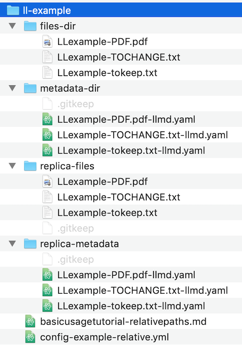

## Longleaf basic usage tutorial

This tutorial provides an introduction to the basic functionality of Longleaf by demonstrating how to configure and execute a small set of preservation tasks, using an example data directory as a local sandbox on your own computer.

**Longleaf basic usage tasks covered in this tutorial:**

* Validate the mandatory Longleaf configuration file that contains the storage locations and preservation activities you will use
* Register example data files
* Validate metadata for registered files
* Run a Preservation action on example data files
* Alter an example data file to cause an error; catch the error by re-running the Preservation action
* Re-register the altered file, and preserve the file in its new, altered state

### System Requirements for this tutorial
Longleaf scripts rely on common UNIX programs. In Mac OS X and Linux operating systems, these programs will likely already be installed, but some of these tools, such as `rsync` may be missing from a Windows system unless you have installed it.

### Example data directory for this tutorial
The example data directory for this tutorial is named 'll-example'; it is located in the 'docs' folder of the longleaf-preservation repository. 

The 'll-example' directory contains all the materials required for completing this tutorial:

* an example configuration file, 'config-example-relative.yml', that is pre-configured for tutorial tasks
* a folder of example data files to be preserved
* empty scaffolding folders that will be used for storing: 1) metadata files about the original data files, 2) the replicated data files created from the originals, and 3) metadata files about the replicated data files.

**folder structure of 'll-example' directory: materials for tutorial tasks**  
```tree
└───ll-example
    │   config-example-relative.yml
    │
    ├───files-dir
    │       LLexample-PDF.pdf
    │       LLexample-TOCHANGE.txt
    │       LLexample-tokeep.txt
    │
    ├───metadata-dir
    │
    │
    ├───replica-files
    │
    │
    └───replica-metadata
```

Subdirectories in 'll-example' are used as follows:

**'files-dir'**  
Contains three example data files that will be preserved and replicated.

**'metadata-dir'**  
Empty at start of tutorial; metadata files about the data files in 'files-dir' will be stored and automatically updated in this directory during Register and Preserve actions.

**'replica-files'**  
Empty at start of tutorial; replicated data files (copies) created during Preserve actions run on the data files in 'files-dir' will be stored in this directory.

**'replica-metadata'**  
Empty at start of tutorial; metadata files about the replicated data files in 'replica-files' will be stored in this directory.

### Set up your local sandbox: copy the example data directory to your Desktop
Copy the 'll-example' directory to a location where it will be easy to access and work with. For example,it might be convenient to copy 'll-example' to your 'Desktop' location.

Note: All paths in the commands in this tutorial are relative to the 'll-example' folder itself, so if you execute commands from within 'll-example,' you can use the paths as shown with no alterations.

### Review the example Longleaf configuration file

**Locations**  
The example configuration file references storage locations based on the subdirectory names in 'll-example':

* The 'data-directory' location points to 'files-dir' as the location of the original data files to be preserved, and 'metadata-dir' for storing metadata files created about these original data files.
* The 'backup-directory' location refers to the 'replica-files' folder as the storage location where the copies of the original files will be stored, and 'replica-metadata' for metadata files.

**Services**  
The 'services' area in the configuration file defines characteristics of work scripts, such as the target storage location for the replication script, and the checksum algorithm for the fixity script.  

**Service Mappings**  
The 'service-mappings' area specifies which services will run at a particular storage location. In the example configuration file, for example, the services 'example_replication' and 'example_fixity' are assigned to run at location 'data-directory'. At location 'backup_directory', however, only 'example_fixity' is assigned to run, so files there will have fixity checks, but will not get replicated.  

```yml
locations: data-directory
  services:
    - example_replication
    - example_fixity
- locations: backup-directory
  services:
      - example_fixity
```

**Relative Paths in the Configuration File**  
Storage locations in this configuration file specify paths relative to the location of the configuration file itself, and will also be evaluated relative to the location of the configuration file itself when Longleaf commands are run. In this tutorial, the configuration file is located inside 'll-example', at the same level as the data and metadata folders.  

### Check that you can run Longleaf, by viewing the help text page
Once you have copied the 'll-example' directory to an accessible working location, and have familiarized yourself with the configuration yaml file, you are ready to start using Longleaf!

First confirm that you can run Longleaf, as you did in the ["Installation Instructions" page](install.md) of this site. Open a terminal window and `cd` into the 'll-example' directory,  then enter the command 'longleaf', with no arguments:    
```
longleaf
```
This command will output the help page text, showing all available commands.

### Validate the example configuration file
Next, you will validate the Longleaf configuration file, to ensure that storage locations and paths are correctly specified and accessible.

As noted above, all paths in this tutorial are relative to the 'll-example' directory, so make sure that you execute commands from within that directory, or amend paths accordingly.

Command for validating configuration file:

```
longleaf validate_config -c config-example-relative.yml
```

Successful validation of the configuration file outputs the following message in terminal:
```
SUCCESS: Application configuration passed validation: config-example-relative.yml
```

### Register example data files
Once the configuration file has been validated, you can proceed to registering the example data files, so that they are ready for further preservation actions with Longleaf.

Note that Longleaf commands can be run on directories, or individual files. For example, when using the Register command, you can either:  

1. register a whole directory at once, which will individually register every file in that directory   
**or**
2. register individual files.

In this example of using the Register command, we will register an entire directory of files by specifying the directory path.

Use command:   
```
longleaf register -c config-example-relative.yml -f files-dir
```
If files successfully registered, Longleaf will list the registration outcome for each file within the directory:
```
SUCCESS register /data/ll-example/files-dir/LLexample-PDF.pdf
SUCCESS register /data/ll-example/files-dir/LLexample-TOCHANGE.txt
SUCCESS register /data/ll-example/files-dir/LLexample-tokeep.txt

```

### Validate the new metadata files
Validate the metadata files that were created for the files you just registered.
Use command:     
```
longleaf validate_metadata -c config-example-relative.yml -f files-dir
```
Confirmation of validation for the metadata files:
```
SUCCESS: Metadata for file passed validation: /data/ll-example/files-dir/LLexample-PDF.pdf
SUCCESS: Metadata for file passed validation: /data/ll-example/files-dir/LLexample-TOCHANGE.txt
SUCCESS: Metadata for file passed validation: /data/ll-example/files-dir/LLexample-tokeep.txt

```


### Run the Preserve command, to replicate and check fixity on the registered files.
Use command:   
```
longleaf preserve -c config-example-relative.yml -f files-dir
```
Confirmation of successful Preservation action completed on all files in the files-dir directory:
```
SUCCESS register /data/ll-example/replica-files/LLexample-PDF.pdf
SUCCESS preserve[example_replication] /data/ll-example/files-dir/LLexample-PDF.pdf
SUCCESS preserve[example_fixity] /data/ll-example/files-dir/LLexample-PDF.pdf
SUCCESS register /data/ll-example/replica-files/LLexample-TOCHANGE.txt
SUCCESS preserve[example_replication] /data/ll-example/files-dir/LLexample-TOCHANGE.txt
SUCCESS preserve[example_fixity] /data/ll-example/files-dir/LLexample-TOCHANGE.txt
SUCCESS register /data/ll-example/replica-files/LLexample-tokeep.txt
SUCCESS preserve[example_replication] /data/ll-example/files-dir/LLexample-tokeep.txt
SUCCESS preserve[example_fixity] /data/ll-example/files-dir/LLexample-tokeep.txt

```

### Look at the output of the Preserve command
Take a look at the SUCCESS output messages from the `preserve` command above.

Notice that for each file included in the Preservation action, Longleaf indicates "SUCCESS" for the "register" and "preserve" components of the Preservation action, as well as the individual scripts within the "preserve" component.

Also take a look inside the subfolders in your 'll-example' sandbox folder, using Finder or command-line tools.

You'll notice that there are newly-created data files and metadata files in the 'replica-' directories. The original data files from 'files-dir' have been copied to the 'replica-files' directory, and metadata files for those copies have been created in the 'replica-metadata' directory.



### Re-run the Preserve command, to check the integrity of the files that are being preserved.

Since the 'example_fixity' script in our example configuration file is set to frequency: 30 seconds, we can check fixity on the preserved files once 30 seconds have elapsed since the last preservation action.

Use command:   
```
longleaf preserve -c config-example-relative.yml -f files-dir
```
Success output message:
```
SUCCESS preserve[example_fixity] /data/ll-example/files-dir/LLexample-PDF.pdf
SUCCESS preserve[example_fixity] /data/ll-example/files-dir/LLexample-TOCHANGE.txt
SUCCESS preserve[example_fixity] /data/ll-example/files-dir/LLexample-tokeep.txt

```
Note that the output in terminal window is much shorter than the first `preserve` command. This output only shows "SUCCESS" and preserve[example_fixity] for each file. This time register and replication are not included because those actions already ran, and do not need to run this time. Only fixity checks ran in this Preserve action.

In the finder window, notice that the Date Modified is updated on the metadata files in the metadata-dir. The metadata files for the original data files are updated to reflect these Preservation actions running.

### Cause a change to a file, and catch the change with the Preservation command.
Now make a change to one of the files that is being preserved, which you will then catch by re-running `preserve` on the storage directory for that file.

Open up the file: 'll-example/files-dir/LLexample-TOCHANGE.txt'. On line 4 of the text file, you'll see "( insert changed text    ) ". Insert your cursor near this line, and type something to make a change to the file. Then save the file and close it. In your 'll-example/files-dir' directory, notice that the Date Modified has changed for this file.

Run the `preserve` command again. This time it will fail, because one of the files under preservation has been altered since the file's last checksums were recorded.   

Use command:   
```
longleaf preserve -c config-example-relative.yml -f files-dir
```
Output showing failed fixity check on the file 'll-example/files-dir/LLexample-TOCHANGE.txt':
```
SUCCESS preserve[example_fixity] /data/ll-example/files-dir/LLexample-PDF.pdf
FAILURE preserve[example_fixity] /data/ll-example/files-dir/LLexample-TOCHANGE.txt: Fixity check using algorithm 'sha1' failed for file /data/ll-example/files-dir/LLexample-TOCHANGE.txt: expected 'effa1bfc1b93f1260a36044bcd668240cf14738a', calculated 'cd5e53f6945ceda2d90b003a39af509d7acb068f.'
SUCCESS preserve[example_fixity] /data/ll-example/files-dir/LLexample-tokeep.txt

```

### Re-register the altered file.
Now you will re-register the altered file, using the `--force` option for the `register` command. Run this registration command at the file level so that only this file is re-registered, not the entire directory.

Re-registration will update the file's preservation metadata to the new state of 'LLexample-TOCHANGE.txt'.

Note, however, that the re-registered altered file (ll-example/files-dir/LLexample-TOCHANGE.txt) will still not match the copy of LLexample-TOCHANGE.txt that is stored in "replica-files" (ll-example/replica-files/LLexample-TOCHANGE.txt), because the replica copy was created earlier, from the unaltered original file.

Use command:   
```
longleaf register -c config-example-relative.yml -f files-dir/LLexample-TOCHANGE.txt --force
```
Success output message:
```
SUCCESS register /data/ll-example/files-dir/LLexample-TOCHANGE.txt
```

### Run Preserve on the re-registered file.
Running `preserve` on the re-registered altered file will replicate the new state of this file to the copied data location. As with `register --force`, run `preserve` at the file level, not the directory.

Use command:   
```
longleaf preserve -c config-example-relative.yml -f files-dir/LLexample-TOCHANGE.txt
```

The terminal output shows the new registration of the file, and the replication and fixity scripts running on this file.
In finder, you can see that the Date Modified of the 'll-example-TOCHANGE.txt' file in the 'replica-files' directory now matches the original file. Open up 'replica-files/ll-example-TOCHANGE.txt' and you'll see the added line of text in this file.

Successful preservation of re-registered changed file:
```
SUCCESS register /data/ll-example/replica-files/LLexample-TOCHANGE.txt
SUCCESS preserve[example_replication] /data/ll-example/files-dir/LLexample-TOCHANGE.txt
SUCCESS preserve[example_fixity] /data/ll-example/files-dir/LLexample-TOCHANGE.txt

```

### Re-run Preserve at the directory level to check all three files.
After the 30-sec fixity check interval has elapsed, re-run the `preserve` command at the directory level as before, and now all three files pass again.

Use command:   
```
longleaf preserve -c config-example-relative.yml -f files-dir
```
Success output message:
```
SUCCESS preserve[example_fixity] /data/ll-example/files-dir/LLexample-PDF.pdf
SUCCESS preserve[example_fixity] /data/ll-example/files-dir/LLexample-TOCHANGE.txt
SUCCESS preserve[example_fixity] /data/ll-example/files-dir/LLexample-tokeep.txt

```
